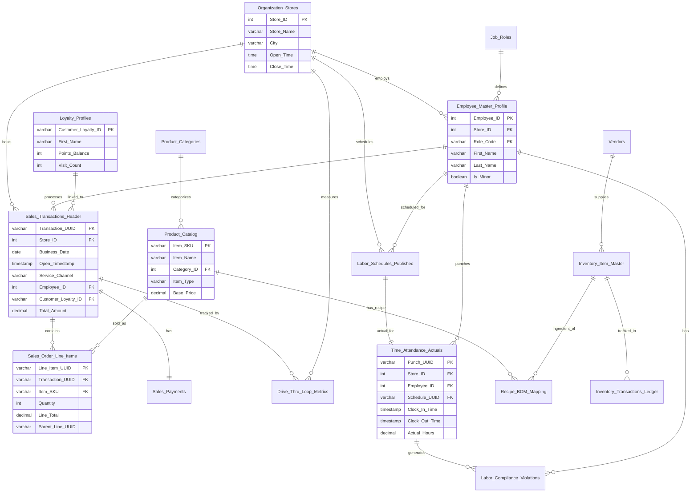

# Swig GM Dashboard - Database Summary

## Overview

| Property | Value |
|----------|-------|
| **Database Type** | DuckDB (embedded SQL database) |
| **File Location** | `swig_operations.duckdb` |
| **Data Range** | January 6-26, 2025 (21 days synthetic data) |
| **Total Tables** | 20 |
| **Total Rows** | ~335,000 |
| **Connection Mode** | Read-only (for API layer) |

---

## Star Schema Diagram



---

## Data Volume Summary

| Table | Row Count | Description |
|-------|-----------|-------------|
| Sales_Transactions_Header | 58,096 | POS transaction headers |
| Sales_Order_Line_Items | 167,997 | Line items (drinks + modifiers) |
| Sales_Payments | 58,096 | Payment records (1:1 with transactions) |
| Drive_Thru_Loop_Metrics | 47,961 | Drive-thru sensor events |
| Loyalty_Profiles | 2,000 | Customer loyalty accounts |
| Labor_Schedules_Published | 1,179 | Published work schedules |
| Time_Attendance_Actuals | 1,179 | Clock in/out records |
| Labor_Compliance_Violations | 149 | Labor law violations |
| Employee_Master_Profile | 66 | Employee records |
| Product_Catalog | 56 | Menu items and SKUs |
| Recipe_BOM_Mapping | 56 | Product ingredient recipes |
| Inventory_Item_Master | 46 | Raw material catalog |
| Product_Categories | 10 | Menu categories |
| Job_Roles | 6 | Position definitions |
| Vendors | 5 | Supplier records |
| Discounts_Promotions | 4 | Active promotions |
| Organization_Stores | 3 | Store locations |
| Daily_Cash_Reconciliation | 0 | (schema only) |
| Equipment_Status | 0 | (schema only) |
| Inventory_Transactions_Ledger | 0 | (schema only) |

---

## Table Reference

### 1. Organization_Stores
**Purpose**: Store master data - physical locations

| Column | Type | Key | Description |
|--------|------|-----|-------------|
| Store_ID | INTEGER | PK | Store identifier (1001, 1002, 1003) |
| Store_Name | VARCHAR(100) | | Display name |
| Address | VARCHAR(255) | | Street address |
| City | VARCHAR(50) | | City |
| State | VARCHAR(2) | | State code |
| Zip | VARCHAR(10) | | ZIP code |
| Latitude | DECIMAL(9,6) | | GPS latitude |
| Longitude | DECIMAL(9,6) | | GPS longitude |
| Timezone | VARCHAR(50) | | Default: America/Denver |
| Open_Time | TIME | | Store opening (06:00:00) |
| Close_Time | TIME | | Store closing (22:00:00) |
| Is_Active | BOOLEAN | | Operational status |
| Open_Date | DATE | | Store launch date |

**Sample Data**:
| Store_ID | Store_Name | City | Open_Date |
|----------|------------|------|-----------|
| 1001 | Swig - St. George Main | St. George | 2020-03-15 |
| 1002 | Swig - Provo Center | Provo | 2019-06-01 |
| 1003 | Swig - Draper | Draper | 2021-01-10 |

---

### 2. Product_Categories
**Purpose**: Menu item categorization

| Column | Type | Key | Description |
|--------|------|-----|-------------|
| Category_ID | INTEGER | PK | Category identifier |
| Category_Name | VARCHAR(50) | | Display name |
| Display_Order | INTEGER | | Sort order |

**Sample Data**:
| Category_ID | Category_Name | Display_Order |
|-------------|---------------|---------------|
| 1 | Signature Drinks | 1 |
| 2 | Dirty Sodas | 2 |
| 3 | Refreshers | 3 |
| 4 | Infusions | 4 |
| 5 | Energy | 5 |

---

### 3. Product_Catalog
**Purpose**: Menu items and SKUs (beverages, modifiers, food)

| Column | Type | Key | Description |
|--------|------|-----|-------------|
| Item_SKU | VARCHAR(20) | PK | SKU code (SIG001, BASE001, MOD001) |
| Item_Name | VARCHAR(100) | | Product name |
| Category_ID | INTEGER | FK | References Product_Categories |
| Item_Type | VARCHAR(20) | | Base_Beverage, Modifier, Food, Merch |
| Base_Price | DECIMAL(6,2) | | Retail price |
| Is_Available | BOOLEAN | | Currently sold |
| Calories | INTEGER | | Nutritional info |
| Size_Oz | INTEGER | | Drink size (32 or 44 oz) |
| Is_Sugar_Free | BOOLEAN | | Dietary flag |
| Description | VARCHAR(255) | | Product description |

**Sample Data**:
| Item_SKU | Item_Name | Item_Type | Base_Price | Description |
|----------|-----------|-----------|------------|-------------|
| SIG001 | Texas Tab | Base_Beverage | $4.29 | Dr Pepper with vanilla and coconut cream |
| SIG002 | Raspberry Dream | Base_Beverage | $4.29 | Dr Pepper with raspberry puree and coconut cream |
| SIG003 | Island Dream | Base_Beverage | $4.29 | Sprite with coconut and pineapple |

---

### 4. Vendors
**Purpose**: Supplier information

| Column | Type | Key | Description |
|--------|------|-----|-------------|
| Vendor_ID | INTEGER | PK | Vendor identifier |
| Vendor_Name | VARCHAR(100) | | Company name |
| Contact_Name | VARCHAR(100) | | Primary contact |
| Contact_Email | VARCHAR(100) | | Email address |
| Contact_Phone | VARCHAR(20) | | Phone number |
| Lead_Time_Days | INTEGER | | Days for delivery |
| Is_Active | BOOLEAN | | Active supplier |

**Sample Data**:
| Vendor_ID | Vendor_Name | Lead_Time_Days |
|-----------|-------------|----------------|
| 1 | Sysco Foods | 2 |
| 2 | Nicholas & Company | 3 |
| 3 | Torani Syrups Direct | 5 |
| 4 | Coca-Cola Bottling | 1 |
| 5 | Dr Pepper Snapple | 1 |

---

### 5. Job_Roles
**Purpose**: Position definitions with compliance rules

| Column | Type | Key | Description |
|--------|------|-----|-------------|
| Role_Code | VARCHAR(20) | PK | Role identifier (GM, ASM, SHIFT, MIX, RUNNER, TRAIN) |
| Role_Name | VARCHAR(50) | | Display name |
| Base_Hourly_Rate | DECIMAL(5,2) | | Standard wage |
| Can_Manage | BOOLEAN | | Management privileges |
| Can_Handle_Cash | BOOLEAN | | Cash access |
| Min_Age | INTEGER | | Minimum age requirement |

**Sample Data**:
| Role_Code | Role_Name | Base_Hourly_Rate | Can_Manage |
|-----------|-----------|------------------|------------|
| GM | General Manager | $22.00 | true |
| ASM | Assistant Manager | $17.00 | true |
| SHIFT | Shift Lead | $14.50 | true |
| MIX | Mixologist | $12.00 | false |
| RUNNER | Runner/Linebuster | $11.50 | false |
| TRAIN | Trainee | $11.00 | false |

---

### 6. Loyalty_Profiles
**Purpose**: Customer loyalty program members

| Column | Type | Key | Description |
|--------|------|-----|-------------|
| Customer_Loyalty_ID | VARCHAR(36) | PK | UUID identifier |
| First_Name | VARCHAR(50) | | Customer first name |
| Phone_Last4 | VARCHAR(4) | | Last 4 digits for lookup |
| Email_Domain | VARCHAR(50) | | Email domain only |
| Join_Date | DATE | | Enrollment date |
| Points_Balance | INTEGER | | Current points |
| Lifetime_Spend | DECIMAL(10,2) | | Total spend ($) |
| Visit_Count | INTEGER | | Total visits |
| Preferred_Store_ID | INTEGER | FK | Home store |
| Last_Visit_Date | DATE | | Most recent visit |

**Sample Data**:
| Customer_Loyalty_ID | First_Name | Points_Balance | Lifetime_Spend | Visit_Count |
|---------------------|------------|----------------|----------------|-------------|
| ba56bada-9e6f-456e-... | Oscar | 0 | $0.00 | 0 |
| cbe3ce67-e22e-4f57-... | Robert | 374 | $37.49 | 7 |
| 9e39282d-c9cd-4dec-... | Lisa | 396 | $39.61 | 7 |

---

### 7. Employee_Master_Profile
**Purpose**: Staff records with compliance tracking

| Column | Type | Key | Description |
|--------|------|-----|-------------|
| Employee_ID | INTEGER | PK | Employee identifier (1001-1099) |
| Store_ID | INTEGER | FK | Work location |
| Harri_UID | VARCHAR(36) | | External HR system ID |
| First_Name | VARCHAR(50) | | First name |
| Last_Name | VARCHAR(50) | | Last name |
| Role_Code | VARCHAR(20) | FK | Job position |
| Hire_Date | DATE | | Start date |
| Date_of_Birth | DATE | | DOB for minor compliance |
| Is_Minor | BOOLEAN | | Under 18 flag |
| Hourly_Wage | DECIMAL(5,2) | | Actual wage |
| Email | VARCHAR(100) | | Work email |
| Phone | VARCHAR(20) | | Contact phone |
| Food_Handler_Exp | DATE | | Certification expiration |
| Status | VARCHAR(20) | | Active, Terminated, Leave, Training |

**Sample Data**:
| Employee_ID | First_Name | Last_Name | Role_Code | Hourly_Wage | Is_Minor |
|-------------|------------|-----------|-----------|-------------|----------|
| 1001 | Danielle | Johnson | GM | $22.60 | false |
| 1002 | Jeffrey | Lawrence | ASM | $16.73 | false |
| 1003 | Amanda | Dudley | ASM | $17.40 | false |

---

### 8. Labor_Schedules_Published
**Purpose**: Planned work shifts

| Column | Type | Key | Description |
|--------|------|-----|-------------|
| Schedule_UUID | VARCHAR(36) | PK | Schedule identifier |
| Store_ID | INTEGER | FK | Work location |
| Employee_ID | INTEGER | FK | Assigned employee |
| Shift_Date | DATE | | Work date |
| Shift_Start | TIMESTAMP | | Scheduled start |
| Shift_End | TIMESTAMP | | Scheduled end |
| Scheduled_Hours | DECIMAL(4,2) | | Planned duration |
| Job_Role | VARCHAR(20) | | Role for this shift |
| Is_Posted | BOOLEAN | | Published to employee |
| Forecast_Sales | DECIMAL(10,2) | | Expected store sales |
| Created_At | TIMESTAMP | | Schedule creation time |

**Sample Data**:
| Schedule_UUID | Employee_ID | Shift_Date | Shift_Start | Shift_End | Scheduled_Hours |
|---------------|-------------|------------|-------------|-----------|-----------------|
| 810fa4eb-... | 1010 | 2025-01-06 | 06:00 | 14:00 | 8.00 |
| 1a6713be-... | 1014 | 2025-01-06 | 06:00 | 14:00 | 8.00 |
| 1a15f0a6-... | 1019 | 2025-01-06 | 06:00 | 14:00 | 8.00 |

---

### 9. Time_Attendance_Actuals
**Purpose**: Actual clock in/out records

| Column | Type | Key | Description |
|--------|------|-----|-------------|
| Punch_UUID | VARCHAR(36) | PK | Punch identifier |
| Store_ID | INTEGER | FK | Work location |
| Employee_ID | INTEGER | FK | Employee |
| Schedule_UUID | VARCHAR(36) | FK | Linked schedule |
| Shift_Date | DATE | | Work date |
| Clock_In_Time | TIMESTAMP | | Actual arrival |
| Clock_Out_Time | TIMESTAMP | | Actual departure |
| Break_Start | TIMESTAMP | | Break start |
| Break_End | TIMESTAMP | | Break end |
| Break_Duration_Minutes | INTEGER | | Break length |
| Actual_Hours | DECIMAL(4,2) | | Hours worked |
| Validation_Method | VARCHAR(20) | | Biometric, Pin, Manager_Override |
| Is_Late | BOOLEAN | | Arrived late flag |
| Late_Minutes | INTEGER | | Minutes late |
| Is_No_Show | BOOLEAN | | Did not show up |

**Sample Data**:
| Punch_UUID | Employee_ID | Clock_In_Time | Clock_Out_Time | Actual_Hours | Validation_Method |
|------------|-------------|---------------|----------------|--------------|-------------------|
| 293ba3d2-... | 1010 | 2025-01-06 05:57 | 2025-01-06 14:16 | 7.81 | Biometric |
| 8d0b90d1-... | 1014 | 2025-01-06 05:57 | 2025-01-06 14:07 | 7.67 | Biometric |
| 756fd43a-... | 1019 | 2025-01-06 06:05 | 2025-01-06 14:00 | 7.41 | Biometric |

---

### 10. Labor_Compliance_Violations
**Purpose**: Labor law violation tracking

| Column | Type | Key | Description |
|--------|------|-----|-------------|
| Violation_UUID | VARCHAR(36) | PK | Violation identifier |
| Store_ID | INTEGER | FK | Store location |
| Employee_ID | INTEGER | FK | Employee involved |
| Punch_UUID | VARCHAR(36) | FK | Associated punch |
| Violation_Date | DATE | | Date of violation |
| Violation_Type | VARCHAR(30) | | Type code |
| Description | VARCHAR(255) | | Violation details |
| Penalty_Cost | DECIMAL(8,2) | | Estimated fine |
| Manager_Ack | BOOLEAN | | Manager acknowledged |
| Resolved | BOOLEAN | | Resolution status |

**Violation Types**:
- `Minor_Late_Hours` - Minor working past 9:30pm ($100 penalty)
- `Minor_Overtime` - Minor exceeding 8-hour limit ($50 penalty)
- `Missed_Break` - No break on shift ≥5 hours ($50 penalty)
- `Short_Turnaround` - <11 hours between shifts
- `Overtime_Without_Approval` - Unauthorized overtime

**Sample Data**:
| Violation_UUID | Employee_ID | Violation_Date | Violation_Type | Penalty_Cost |
|----------------|-------------|----------------|----------------|--------------|
| 8a069f30-... | 1016 | 2025-01-06 | Missed_Break | $50.00 |
| f07b7ad9-... | 1017 | 2025-01-06 | Missed_Break | $50.00 |
| 440850c1-... | 1035 | 2025-01-06 | Missed_Break | $50.00 |

---

### 11. Sales_Transactions_Header
**Purpose**: POS transaction records (one per order)

| Column | Type | Key | Description |
|--------|------|-----|-------------|
| Transaction_UUID | VARCHAR(36) | PK | Transaction identifier |
| Store_ID | INTEGER | FK | Store location |
| Business_Date | DATE | | Order date |
| Open_Timestamp | TIMESTAMP | | Order placed time |
| Close_Timestamp | TIMESTAMP | | Order fulfilled time |
| Service_Channel | VARCHAR(20) | | Drive_Thru, Walk_Up, Mobile_Pickup, Delivery_3rdParty |
| Order_Source_Device | VARCHAR(50) | | Device ID (Window_POS_02, Tablet_LB_03) |
| Employee_ID | INTEGER | FK | Processing employee |
| Customer_Loyalty_ID | VARCHAR(36) | FK | Linked loyalty account |
| Queue_Position | INTEGER | | Drive-thru queue position |
| Vehicle_Descriptor | VARCHAR(100) | | Vehicle description |
| Subtotal_Amount | DECIMAL(10,2) | | Pre-tax amount |
| Tax_Amount | DECIMAL(10,2) | | Tax at 7.25% |
| Discount_Total | DECIMAL(10,2) | | Applied discounts |
| Total_Amount | DECIMAL(10,2) | | Final tender amount |
| Is_Voided | BOOLEAN | | Canceled order |

**Sample Data**:
| Transaction_UUID | Store_ID | Business_Date | Service_Channel | Total_Amount | Vehicle_Descriptor |
|------------------|----------|---------------|-----------------|--------------|-------------------|
| 78a4e760-... | 1001 | 2025-01-06 | Drive_Thru | $9.20 | Blue Honda Accord |
| 156dd0c9-... | 1001 | 2025-01-06 | Drive_Thru | $19.89 | Silver Kia Forte |
| d213cb0f-... | 1001 | 2025-01-06 | Drive_Thru | $13.15 | Gold Honda CR-V |

---

### 12. Sales_Order_Line_Items
**Purpose**: Individual items per transaction (drinks + modifiers)

| Column | Type | Key | Description |
|--------|------|-----|-------------|
| Line_Item_UUID | VARCHAR(36) | PK | Line item identifier |
| Transaction_UUID | VARCHAR(36) | FK | Parent transaction |
| Item_SKU | VARCHAR(20) | FK | Product SKU |
| Item_Name | VARCHAR(100) | | Product name (denormalized) |
| Item_Type | VARCHAR(20) | | Base_Beverage, Modifier, Food, Merch |
| Quantity | INTEGER | | Quantity ordered |
| Unit_Price | DECIMAL(6,2) | | Price at sale |
| Line_Total | DECIMAL(8,2) | | Quantity × Unit_Price |
| Parent_Line_UUID | VARCHAR(36) | | Self-reference to base drink |
| Modifier_Group | VARCHAR(50) | | Cream, Syrup, Puree, etc. |
| Price_Override | DECIMAL(6,2) | | Manual price adjustment |
| Is_Comped | BOOLEAN | | Free item |

**Note**: Modifiers reference their parent base beverage via `Parent_Line_UUID` to form order hierarchy.

**Sample Data**:
| Line_Item_UUID | Transaction_UUID | Item_SKU | Item_Name | Item_Type | Line_Total |
|----------------|------------------|----------|-----------|-----------|------------|
| bc9e01cf-... | 78a4e760-... | SIG001 | Texas Tab | Base_Beverage | $4.29 |
| fbadbc46-... | 78a4e760-... | SIG002 | Raspberry Dream | Base_Beverage | $4.29 |
| edc263d7-... | 156dd0c9-... | BASE007 | Mountain Dew | Base_Beverage | $2.99 |

---

### 13. Sales_Payments
**Purpose**: Payment details per transaction

| Column | Type | Key | Description |
|--------|------|-----|-------------|
| Payment_UUID | VARCHAR(36) | PK | Payment identifier |
| Transaction_UUID | VARCHAR(36) | FK | Parent transaction |
| Tender_Type | VARCHAR(20) | | Credit_Card, Debit_Card, Cash, Apple_Pay, Google_Pay, Swig_Gift_Card, Loyalty_Points |
| Amount_Tendered | DECIMAL(10,2) | | Total + tip |
| Tip_Amount | DECIMAL(6,2) | | Tip amount |
| Change_Given | DECIMAL(6,2) | | Cash change |
| Auth_Code | VARCHAR(20) | | Card authorization |
| Masked_PAN | VARCHAR(4) | | Last 4 digits |
| Payment_Timestamp | TIMESTAMP | | Payment time |
| Is_Refund | BOOLEAN | | Refund flag |

**Payment Distribution**: 55% credit, 20% debit, 12% Apple Pay, 5% Google Pay, 5% cash, 2% gift card, 1% loyalty

**Sample Data**:
| Payment_UUID | Transaction_UUID | Tender_Type | Amount_Tendered | Tip_Amount | Masked_PAN |
|--------------|------------------|-------------|-----------------|------------|------------|
| 95b1c756-... | 78a4e760-... | Debit_Card | $14.20 | $5.00 | 6246 |
| d2aedcb1-... | 156dd0c9-... | Debit_Card | $24.89 | $5.00 | 7036 |
| 7f11c95c-... | d213cb0f-... | Credit_Card | $13.15 | $0.00 | 9975 |

---

### 14. Drive_Thru_Loop_Metrics
**Purpose**: Car sensor data for drive-thru efficiency

| Column | Type | Key | Description |
|--------|------|-----|-------------|
| Loop_Event_UUID | VARCHAR(36) | PK | Event identifier |
| Store_ID | INTEGER | FK | Store location |
| Transaction_UUID | VARCHAR(36) | FK | Linked transaction |
| Sensor_ID | VARCHAR(20) | | Entry, Menu_Board, Order_Point, Window, Pickup, Exit |
| Arrival_Time | TIMESTAMP | | Car enters zone |
| Departure_Time | TIMESTAMP | | Car exits zone |
| Duration_Seconds | INTEGER | | Time in zone |
| Car_Count_Hour | INTEGER | | Cars in same hour |
| Business_Date | DATE | | Business date |

**Sample Data**:
| Loop_Event_UUID | Store_ID | Sensor_ID | Duration_Seconds | Car_Count_Hour |
|-----------------|----------|-----------|------------------|----------------|
| f4ef0897-... | 1001 | Window | 379 | 1 |
| 9ac88191-... | 1001 | Window | 257 | 2 |
| b3037816-... | 1001 | Window | 311 | 3 |

---

### 15. Inventory_Item_Master
**Purpose**: Raw material catalog

| Column | Type | Key | Description |
|--------|------|-----|-------------|
| Inventory_ID | INTEGER | PK | Item identifier |
| Description | VARCHAR(100) | | Item name |
| Category | VARCHAR(50) | | Syrup, Puree, Dairy, Base_Carbonated, Energy, Paper_Goods, Food_Prep, Ice |
| Vendor_ID | INTEGER | FK | Supplier |
| Count_UOM | VARCHAR(20) | | Receiving unit (Bottle, Case, Bag, BIB) |
| Recipe_UOM | VARCHAR(20) | | Recipe unit (oz, pump, ml, count) |
| Conversion_Factor | DECIMAL(8,4) | | Count_UOM → Recipe_UOM ratio |
| Unit_Cost | DECIMAL(8,4) | | Cost per Count_UOM |
| Par_Level | DECIMAL(10,2) | | Target quantity |
| Reorder_Point | DECIMAL(10,2) | | Minimum before reorder |
| Is_Active | BOOLEAN | | Currently used |

**Sample Data**:
| Inventory_ID | Description | Category | Unit_Cost | Par_Level |
|--------------|-------------|----------|-----------|-----------|
| 101 | Torani Vanilla Syrup | Syrup | $8.99 | 6.00 |
| 102 | Torani Raspberry Syrup | Syrup | $8.99 | 6.00 |
| 103 | Torani Coconut Syrup | Syrup | $8.99 | 6.00 |

---

### 16. Recipe_BOM_Mapping
**Purpose**: Product-to-ingredient mapping (Bill of Materials)

| Column | Type | Key | Description |
|--------|------|-----|-------------|
| Recipe_ID | INTEGER | PK | Recipe line identifier |
| Sales_Item_SKU | VARCHAR(20) | FK | Menu item SKU |
| Inventory_ID | INTEGER | FK | Ingredient ID |
| Quantity_Required | DECIMAL(8,4) | | Amount needed |
| Recipe_UOM | VARCHAR(20) | | Unit of measure |
| Yield_Loss_Pct | DECIMAL(5,4) | | Waste factor (0-5%) |
| Is_Optional | BOOLEAN | | Optional modifier |

**Sample Data** (Texas Tab - SIG001):
| Recipe_ID | Sales_Item_SKU | Inventory_ID | Quantity_Required | Recipe_UOM |
|-----------|----------------|--------------|-------------------|------------|
| 1 | SIG001 | 401 | 12.0000 | oz |
| 2 | SIG001 | 101 | 2.0000 | pump |
| 3 | SIG001 | 301 | 1.5000 | oz |

---

### 17. Inventory_Transactions_Ledger
**Purpose**: Stock movement audit trail (schema only - no data)

| Column | Type | Key | Description |
|--------|------|-----|-------------|
| Trans_UUID | VARCHAR(36) | PK | Transaction identifier |
| Store_ID | INTEGER | FK | Store location |
| Inventory_ID | INTEGER | FK | Inventory item |
| Transaction_Date | DATE | | Date |
| Transaction_Time | TIMESTAMP | | Time |
| Transaction_Type | VARCHAR(30) | | Delivery_Received, Sales_Usage, Waste_Log, Transfer_Out, Transfer_In, Audit_Adjustment |
| Quantity_Change | DECIMAL(10,4) | | +/- quantity |
| Running_Balance | DECIMAL(10,4) | | Balance after |
| Cost_Value | DECIMAL(10,4) | | Cost impact |
| Reason_Code | VARCHAR(50) | | Reason |
| Reference_ID | VARCHAR(36) | | Links to Transaction_UUID |
| Employee_ID | INTEGER | FK | Who recorded |

---

### 18. Daily_Cash_Reconciliation
**Purpose**: End-of-day cash counts (schema only - no data)

| Column | Type | Key | Description |
|--------|------|-----|-------------|
| Reconciliation_UUID | VARCHAR(36) | PK | Record identifier |
| Store_ID | INTEGER | FK | Store location |
| Business_Date | DATE | | Business date |
| Shift | VARCHAR(20) | | Opening, Mid, Closing |
| Expected_Cash | DECIMAL(10,2) | | POS calculated |
| Actual_Cash | DECIMAL(10,2) | | Counted amount |
| Variance | DECIMAL(10,2) | | Difference |
| Variance_Pct | DECIMAL(5,4) | | Variance percent |
| Counted_By_Employee_ID | INTEGER | FK | Counter |
| Verified_By_Employee_ID | INTEGER | FK | Verifier |
| Count_Timestamp | TIMESTAMP | | When counted |
| Notes | VARCHAR(255) | | Explanation |

---

### 19. Discounts_Promotions
**Purpose**: Active promotions and coupons

| Column | Type | Key | Description |
|--------|------|-----|-------------|
| Promo_ID | INTEGER | PK | Promotion identifier |
| Promo_Code | VARCHAR(20) | UNIQUE | Coupon code |
| Promo_Name | VARCHAR(100) | | Display name |
| Promo_Type | VARCHAR(20) | | Percent_Off, Dollar_Off, BOGO, Free_Item, Happy_Hour |
| Discount_Value | DECIMAL(5,2) | | Discount amount |
| Min_Purchase | DECIMAL(6,2) | | Minimum order |
| Applicable_Items | VARCHAR(255) | | SKU list or 'ALL' |
| Start_Date | DATE | | Promo start |
| End_Date | DATE | | Promo end |
| Is_Active | BOOLEAN | | Currently active |
| Usage_Count | INTEGER | | Times used |

**Sample Data**:
| Promo_ID | Promo_Code | Promo_Name | Promo_Type | Discount_Value |
|----------|------------|------------|------------|----------------|
| 1 | HAPPYHOUR | Happy Hour 2-4pm | Percent_Off | 20.00 |
| 2 | FIRSTSWIG | First Time Customer | Dollar_Off | 2.00 |
| 3 | BOGO50 | Buy One Get One 50% Off | BOGO | 50.00 |

---

### 20. Equipment_Status
**Purpose**: Equipment state tracking (schema only - no data)

| Column | Type | Key | Description |
|--------|------|-----|-------------|
| Status_UUID | VARCHAR(36) | PK | Status identifier |
| Store_ID | INTEGER | FK | Store location |
| Equipment_ID | VARCHAR(20) | | Model/serial |
| Equipment_Type | VARCHAR(50) | | Ice_Machine, Soda_Fountain, Syrup_Pump, Refrigerator, etc. |
| Equipment_Name | VARCHAR(100) | | Display name |
| Status | VARCHAR(20) | | Operational, Degraded, Down, Maintenance |
| Status_Change_Time | TIMESTAMP | | When changed |
| Expected_Resolution | TIMESTAMP | | ETA for repair |
| Impact_Level | VARCHAR(20) | | None, Low, Medium, High, Critical |
| Notes | VARCHAR(255) | | Issue details |
| Reported_By_Employee_ID | INTEGER | FK | Reporter |

---

## Indexes

```sql
CREATE INDEX idx_transactions_store_date ON Sales_Transactions_Header(Store_ID, Business_Date);
CREATE INDEX idx_transactions_employee ON Sales_Transactions_Header(Employee_ID);
CREATE INDEX idx_transactions_timestamp ON Sales_Transactions_Header(Open_Timestamp);
CREATE INDEX idx_line_items_transaction ON Sales_Order_Line_Items(Transaction_UUID);
CREATE INDEX idx_line_items_sku ON Sales_Order_Line_Items(Item_SKU);
CREATE INDEX idx_payments_transaction ON Sales_Payments(Transaction_UUID);
CREATE INDEX idx_loop_metrics_store_date ON Drive_Thru_Loop_Metrics(Store_ID, Business_Date);
CREATE INDEX idx_employees_store ON Employee_Master_Profile(Store_ID);
CREATE INDEX idx_schedules_employee_date ON Labor_Schedules_Published(Employee_ID, Shift_Date);
CREATE INDEX idx_attendance_employee_date ON Time_Attendance_Actuals(Employee_ID, Shift_Date);
CREATE INDEX idx_inventory_ledger_store_date ON Inventory_Transactions_Ledger(Store_ID, Transaction_Date);
CREATE INDEX idx_inventory_ledger_item ON Inventory_Transactions_Ledger(Inventory_ID);
```

---

## Common DBA Queries

### Daily Revenue by Store
```sql
SELECT Store_ID, Business_Date,
       COUNT(*) as transaction_count,
       SUM(Total_Amount) as daily_revenue
FROM Sales_Transactions_Header
WHERE Is_Voided = false
GROUP BY Store_ID, Business_Date
ORDER BY Business_Date, Store_ID;
```

### Top Selling Products
```sql
SELECT Item_SKU, Item_Name, Item_Type,
       SUM(Quantity) as units_sold,
       SUM(Line_Total) as total_revenue
FROM Sales_Order_Line_Items
WHERE Item_Type = 'Base_Beverage'
GROUP BY Item_SKU, Item_Name, Item_Type
ORDER BY units_sold DESC
LIMIT 10;
```

### Labor Compliance Summary
```sql
SELECT emp.First_Name, emp.Last_Name, emp.Role_Code,
       COUNT(lcv.Violation_UUID) as violation_count,
       SUM(lcv.Penalty_Cost) as total_penalties
FROM Employee_Master_Profile emp
LEFT JOIN Labor_Compliance_Violations lcv ON emp.Employee_ID = lcv.Employee_ID
GROUP BY emp.Employee_ID, emp.First_Name, emp.Last_Name, emp.Role_Code
HAVING COUNT(lcv.Violation_UUID) > 0
ORDER BY violation_count DESC;
```

### Drive-Thru Speed Analysis
```sql
SELECT EXTRACT(HOUR FROM Arrival_Time) as hour,
       AVG(Duration_Seconds) as avg_seconds,
       COUNT(*) as car_count
FROM Drive_Thru_Loop_Metrics
WHERE Sensor_ID = 'Window'
GROUP BY EXTRACT(HOUR FROM Arrival_Time)
ORDER BY hour;
```

### Service Channel Distribution
```sql
SELECT Service_Channel,
       COUNT(*) as transactions,
       ROUND(COUNT(*) * 100.0 / SUM(COUNT(*)) OVER(), 2) as percentage
FROM Sales_Transactions_Header
GROUP BY Service_Channel
ORDER BY transactions DESC;
```

---

## Notes for DBAs

- **UUID Fields**: All primary keys use VARCHAR(36) UUID strings (not binary) for multi-system integration
- **Timezone**: All stores operate in America/Denver (Mountain Time)
- **Tax Rate**: 7.25% (Utah standard) hardcoded in application
- **Currency**: USD with 2 decimal precision (DECIMAL(x,2))
- **Timestamps**: Full datetime; Business_Date fields are DATE only
- **Connection**: Use read-only mode for API queries to prevent accidental modifications
- **Backup**: Single file backup; regenerate from seed SQL if needed
